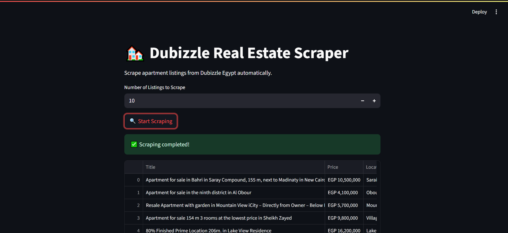

# 🏘️ Dubizzle Real Estate Scraper

A simple and efficient web scraping app to extract **apartment listings** from [Dubizzle Egypt](https://www.dubizzle.com.eg/en/property-for-sale/residential/apartmentflat/) — built using **Streamlit**, **Selenium**, and **Pandas**.

---

## 📸 Demo

 <!-- Replace this with your actual screenshot if available -->

---

## 🚀 Features

- Set the number of **apartment listings** to scrape
- Extract details like **title, price, location, area, bedrooms, bathrooms**, and more
- **Preview results** directly in the web interface
- **Export to CSV** with one click
- Automatically manages ChromeDriver — no setup needed

---

## 🛠 Tech Stack

- `Python 3.10+`
- `Streamlit` – interactive web UI
- `Selenium` – web scraping engine
- `webdriver-manager` – auto-downloads ChromeDriver
- `Pandas` – for data formatting and export

---

## 📂 Project Structure
```
📁 dubizzle-realestate-scraper/
│
├── app.py # Streamlit web app
├── scraper.py # Real estate scraping logic
├── output_example.csv
├── requirements.txt
└── README.md # Project documentation
```

---

## ⚙️ Installation & Usage

### 🔧 1. Clone & Install Dependencies

```
git clone https://github.com/yourusername/dubizzle-realestate-scraper.git
cd dubizzle-realestate-scraper
pip install -r requirements.txt
```

### ▶️ 2. Run the App

```
streamlit run app.py
```

## ✅ To-Do / Future Features

Add filters for location, price, bedrooms, etc.

Scrape other property types (e.g., villas, offices)

Add search history or saved queries

Enable scheduling / auto scraping

Arabic language support for local users

---

## 🤝 Contributing
Pull requests are welcome. If you'd like to suggest features or report bugs, please open an issue.

---

## 📄 License
MIT License — free for personal and commercial use.

